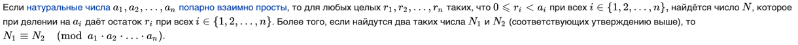
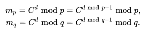

# RSA

RSA (аббревиатура от фамилий Rivest, Shamir и Adleman) — криптографический алгоритм с открытым ключом, основывающийся на вычислительной сложности задачи факторизации больших полупростых чисел.

Криптосистема RSA стала первой системой, пригодной и для шифрования, и для цифровой подписи. 
Алгоритм используется в большом числе криптографических приложений, включая PGP, S/MIME, TLS/SSL, IPSEC/IKE и других.

## Алгоритм создания открытого и секретного ключей
RSA-ключи генерируются следующим образом:

1) выбираются два различных случайных простых числа 
`p` и `q` заданного размера (например, 1024 бита каждое);
2) вычисляется их произведение
`n = p * q`, которое называется модулем;
3) вычисляется значение функции Эйлера от числа `n`:
`φ(n) = (p − 1) * (q −1)` ;
4) выбирается целое число `e ( 1 < e < φ(n) )`, взаимно простое со значением функции `φ(n)`;\
число `e` называется открытой экспонентой (англ. public exponent);\
обычно в качестве `e` берут простые числа, содержащие небольшое количество единичных бит в двоичной записи, например,
простые из чисел Ферма: `17`, `257` или `65537`, так как в этом случае время, необходимое для шифрования с использованием
быстрого возведения в степень, будет меньше;\
слишком малые значения `e`, например `3`, потенциально могут ослабить безопасность схемы RSA;
5) вычисляется число `d`, мультипликативно обратное к числу `e` по модулю `φ(n)`, то есть число, удовлетворяющее сравнению:
`d * e ≡ 1(mod φ(n))`
(число `d` называется секретной экспонентой; обычно оно вычисляется при помощи расширенного алгоритма Евклида);
6) пара `(e , n)` публикуется в качестве открытого ключа RSA (англ. RSA public key);
7) пара `(d , n)` играет роль закрытого ключа RSA (англ. RSA private key) и держится в секрете.

**Схема шифрования и дешифрования**


## Алгоритм шифрования:

1) Взять открытый ключ `(e , n)` Алисы 
2) Взять открытый текст `m`
3) Зашифровать сообщение с использованием открытого ключа Алисы:
    ```math
    c = E(m)= m^e mod n
    ```

## Алгоритм расшифрования:

1) Принять зашифрованное сообщение `c`
2) Взять свой закрытый ключ `(d , n)`
3) Применить закрытый ключ для расшифрования сообщения:
    ```math
    m = D(c)= c^d mod n
    ```
   
**Пример алгоритма**


## Усовершенствования

### Использование китайской теоремы об остатках для ускорения расшифрования

**Формулировка**


При расшифровании или подписывании сообщения в алгоритме RSA показатель вычисляемой степени будет довольно большим числом (порядка 1000 бит). 
Поэтому требуется алгоритм, сокращающий количество операций. 

Так как числа `p` и `q` в разложении `N = p * q` известны владельцу закрытого ключа, то можно вычислить:\


Поскольку `p` и `q` — числа порядка `2^512`, на эти действия потребуется два возведения числа в 512-битовую степень по модулю 512-битового числа. 
Это существенно (для 1024 бит тестирование показало в 3 раза) быстрее, чем одно возведение в 1024-битовую степень по модулю 1024-битового числа. 
Далее осталось восстановить 
`m` по `m_p` и `m_q`, что можно сделать с помощью китайской теоремы об остатках.

### Использование алгоритма быстрого возведения в степень для ускорения процесса шифрования RSA

Алгоритмы быстрого возведения в степень (дихотомический алгоритм возведения в степень, бинарный алгоритм возведения в степень) — алгоритмы, предназначенные для возведения числа `x` в натуральную степень `n` за меньшее число умножений, чем это требуется в определении степени.
Многие из этих алгоритмов основаны на том, что для возведения числа `x` в степень `n` не обязательно перемножать число `x` на само себя `n` раз, а можно перемножать уже вычисленные степени. 
В частности, если `n = 2^k` степень двойки, то для возведения в степень `n` достаточно число возвести в квадрат `k` раз, затратив при этом `k` умножений вместо `2^k`. 
Например, чтобы возвести число `x` в восьмую степень, вместо выполнения семи умножений 
`x ⋅ x ⋅ x ⋅ x ⋅ x ⋅ x ⋅ x ⋅ x`
можно возвести число в квадрат `(x^2 = x ⋅ x)`, потом результат возвести ещё раз в квадрат и получить четвёртую степень 
`(x^4 = x^2 ⋅ x^2)`, и наконец результат ещё раз возвести в квадрат и получить ответ `(x^8 = x^4 ⋅ x^4)`.

Кроме того, некоторые алгоритмы для дальнейшей оптимизации используют тот факт, что операция возведения в квадрат быстрее операции умножения за счёт того, что при возведении в квадрат цифры в сомножителе повторяются

### PKCS7 padding (Дополнение)
PKCS#7 описано в RFC 5652.
Дополнение (англ. padding) в криптографии — добавление ничего не значащих данных к зашифровываемой информации, нацеленное на повышение криптостойкости.

Дополнение в целых байтах. Значение каждого байта равно числу добавленных байтов, то есть добавляется N байт со значением N. Число добавленных байтов зависит от границы блока, до которого необходимо расширить сообщение. Дополнение будет одним из:
```
01
02 02
03 03 03
04 04 04 04
05 05 05 05 05
etc.
```

Данный метод дополнения (также как и два предыдущих) хорошо определён, только если N меньше, чем 256.

Пример: В следующем примере блок имеет размер 8 байтов, и требуется дополнение 4 байтами
```
... | DD DD DD DD DD DD DD DD | DD DD DD DD 04 04 04 04 |
```

